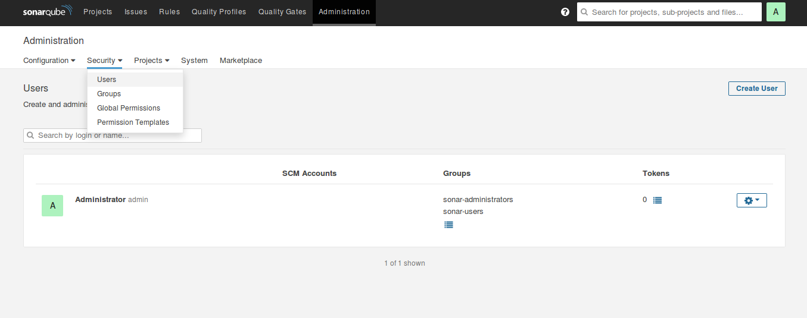
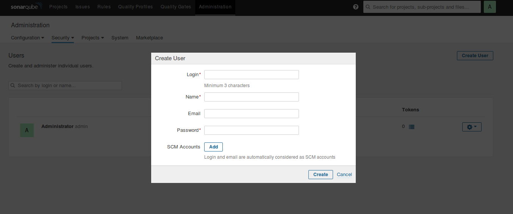
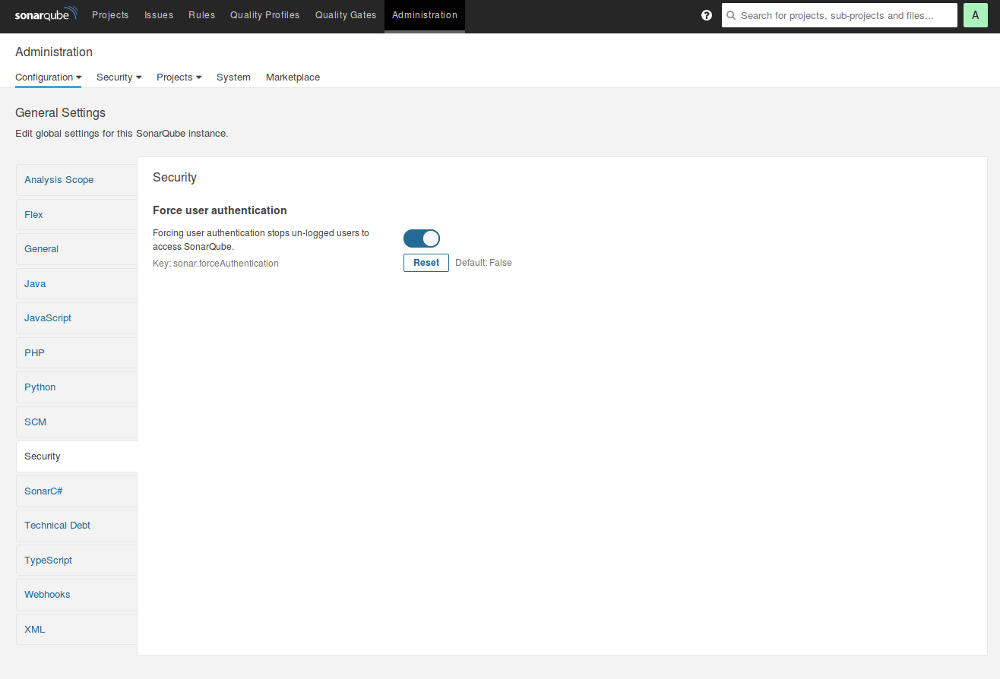

# How To Install SonarQube on Ubuntu 20.04LTS

The following contents have been quoted from [the following site](https://www.vultr.com/docs/install-sonarqube-on-ubuntu-20-04-lts).

This document will talk about how to install SonarQube on Ubuntu 20.04LTS manually step by step, so that you know
what is going on and learn from it. However, if you just want to use it, you can use: [SonarQube Docker Container](https://www.sonarqube.org/features/deployment/) 
There is also a vagrant box for SonarQube, but it is not official, so I do not recommend it.

There are also many SonarQube tutorials on YouTube. (ex. [How to analyze code quality using SonarQube](https://youtu.be/2F3PYGtQr5k)).
So, if you need some help using SonarQube, it will be easy to find information you need on Internet.

That's it! Let's do it.


## 1. Prepare your Ubuntu server.
* SSH to your Ubuntu server as a non-root user with sudo access.
* Update your server.
```bash
sudo apt update
sudo apt upgrade -y
```

## 2. Install OpenJDK 11

* Install OpenJDK 11.
```bash
sudo apt install -y openjdk-11-jdk
```

## 3. Install and Configure PostgreSQL

* Add PostgreSQL repository.
```bash
sudo sh -c 'echo "deb http://apt.postgresql.org/pub/repos/apt/ `lsb_release -cs`-pgdg main" >> /etc/apt/sources.list.d/pgdg.list'
```

* Add PostgreSQL signing key.
```bash
wget -q https://www.postgresql.org/media/keys/ACCC4CF8.asc -O - | sudo apt-key add -
```

* Install PostgreSQL.
```bash
sudo apt install -y postgresql postgresql-contrib
```

* Enable DB server to start automatically on reboot.
```bash
sudo systemctl enable postgresql
```

* Start DB server.
```bash
sudo systemctl start postgresql
```

* Change the default PostgreSQL password.
```bash
sudo passwd postgres
```

* Switch to the postgres user.
```bash
su - postgres
```

* Create a user named `sonar`.
```bash
createuser sonar
```

* Log into PostgreSQL.
```bash
psql
```

* Set a password for the `sonar` user. Use a strong password in place of `my_strong_password`.
```bash
ALTER USER sonar WITH ENCRYPTED password 'my_strong_password';
```

* Create SonarQube database and set its owner to `sonar`.
```bash
CREATE DATABASE sonarqube OWNER sonar;
```

* Grant all privileges on SonarQube database to the user `sonar`.
```bash
GRANT ALL PRIVILEGES ON DATABASE sonarqube to sonar;
```

* Exit PostgreSQL.
```bash
\q
```

* Return to your non-root sudo user account.
```bash
exit
```

## 4. Download and Install SonarQube

* Install the zip utility, which is needed to unzip the SonarQube files.
```bash
sudo apt install -y zip
```

* Locate the latest download URL from [SonarQube official download page](https://www.sonarqube.org/downloads/).
At the time of writing this document, the download URL was as follows: 
```bash
https://binaries.sonarsource.com/Distribution/sonarqube/sonarqube-9.0.1.46107.zip
```

* Download the SonarQube distribution files.
```bash
sudo wget https://binaries.sonarsource.com/Distribution/sonarqube/sonarqube-9.0.1.46107.zip
```

* Unzip the downloaded file.
```bash
sudo unzip sonarqube-9.0.1.46107.zip
```

* Move the unzipped files to `/opt/sonarqube` directory
```bash
sudo mv sonarqube-9.0.1.46107 /opt/sonarqube
```

## 5. Add SonarQube Group and User

* Create a `sonar` group.
```bash
sudo groupadd sonar
```

* Create a `sonar` user and set `/opt/sonarqube` as the home directory.
```bash
sudo useradd -d /opt/sonarqube -g sonar sonar
```

* Grant the `sonar` user access to the `/opt/sonarqube` directory.
```bash
sudo chown sonar:sonar /opt/sonarqube -R
```

## 6. Configure SonarQube

* Edit the SonarQube configuration file.
```bash
sudo nano /opt/sonarqube/conf/sonar.properties
```
> **Step 1:** Find the following lines.
>```
>#sonar.jdbc.username=
>#sonar.jdbc.password=
>```
> **Step 2:** Uncomment the lines, and add the database user `sonar` and password `my_strong_password` you created in Section 3.
>```
>sonar.jdbc.username=sonar
>sonar.jdbc.password=my_strong_password
>```
> **Step 3:** Below those two lines, add `sonar.jdbc.url`.
>```
>sonar.jdbc.url=jdbc:postgresql://localhost:5432/sonarqube
>```
> **Step 4:** Save and exit the file.

* Edit the sonar script file.
```bash
sudo nano /opt/sonarqube/bin/linux-x86-64/sonar.sh
```
>**Step 1:** About 50 lines down, locate this line.
>```
>#RUN_AS_USER=
>```
> **Step 2:** Uncomment the line and change it to.
>```
>RUN_AS_USER=sonar
>```
> **Step 3:** Save and exit the file.

## 7. Setup Systemd Service

* Create a systemd service file to start SonarQube at system boot.
```bash
sudo nano /etc/systemd/system/sonar.service
```
> **Step 1:** Paste the following lines to the file.
>```
>[Unit]
>Description=SonarQube service
>After=syslog.target network.target
>
>[Service]
>Type=forking
>
>ExecStart=/opt/sonarqube/bin/linux-x86-64/sonar.sh start
>ExecStop=/opt/sonarqube/bin/linux-x86-64/sonar.sh stop
>
>User=sonar
>Group=sonar
>Restart=always
>
>LimitNOFILE=65536
>LimitNPROC=4096
>
>[Install]
>WantedBy=multi-user.target
>```
> **Step 2:** Save and exit the file.

* Enable the SonarQube service to run at system startup.
```bash
sudo systemctl enable sonar
```

* Start the SonarQube service.
```bash
sudo systemctl start sonar
```

* Check the service status.
```bash
sudo systemctl status sonar
```

## 8. Modify Kernel System Limits

SonarQube uses `Elasticsearch` to store its indices in an MMap FS directory. It requires some changes to the system defaults.

* Edit the sysctl configuration file.
```bash
sudo nano /etc/sysctl.conf
```
> **Step 1:** Add the following lines.
>```
>vm.max_map_count=262144
>fs.file-max=65536
>ulimit -n 65536
>ulimit -u 4096
>``` 
> **Step 2:** Save and exit the file.

* Reboot the system to apply the changes.
```bash
sudo reboot
```

## 9. Access SonarQube Web Interface

* Access SonarQube in a web browser at your server's IP address on port 9000. For example:
```
http://localhost:9000
```

* Log in with username `admin` and password `admin`. SonarQube will prompt you to change your password.

> **WARNING!** 
> SonarQube ships with a default administrator username and password of admin. This default password is not secure, so you’ll want to update it to something more secure as a good security practice.

## 10. Secure SonarQube

> **NOTE:**
> The following contents were quoted from [DigitlOcean site tutorial page](https://www.digitalocean.com/community/tutorials/how-to-ensure-code-quality-with-sonarqube-on-ubuntu-18-04),
> especially from **Step 5 - Securing SonarQube** to the end of that page.

Start by visiting the URL of your installation, and log in using the default credentials. 
If prompted to start a tutorial, simply click Skip this tutorial to get to the dashboard.

Once logged in, click the `Administration` tab from the top menu, select `Security` from the drop-down list, 
and then select `Users`:



From here, click on the small cog on the right of the `Administrator` account row, then click on `Change password`. 
Be sure to change the password to something that’s easy to remember but hard to guess.

Now create a normal user that you can use to create projects and submit analysis results to your server 
from the same page. Click on the `Create User` button on the top-right of the page:



Then create a token for a specific user by clicking on the button in the `Tokens` column 
and giving this token a name. You’ll need this token later when you invoke the code scanner, 
so be sure to write it down in a safe place.

Finally, you may notice that the SonarQube instance is wide-open to the world, 
and anyone could view analysis results and your source code. This setting is highly insecure, 
so we’ll configure SonarQube to only allow logged-in users access to the dashboard. 
From the same `Administration` tab, click on `Configuration`, then `General` Settings, 
and then `Security` on the left pane. Flip the switch that says `Force user authentication` to enable authentication,
then click on the `Save` button below the switch.



Now that you’re done setting up the server, let’s set up the SonarQube scanner.


## 11. Setting Up the Code Scanner

SonarQube’s code scanner is a separate package that you can install on a different machine than the one running 
the SonarQube server, such as your local development workstation or a continuous delivery server. There are 
packages available for Windows, MacOS, and Linux which you can find at [the SonarQube web site](https://docs.sonarqube.org/latest/analysis/scan/sonarscanner/).

In this tutorial, you’ll install the code scanner on the same server that hosts our SonarQube server.

* Start by creating a directory for the scanner:
```bash
sudo mkdir /opt/sonarscanner
```

* Change into that directory:
```bash
cd /opt/sonarscanner
```

* Download the SonarQube scanner for Linux using wget:
```bash
sudo wget https://binaries.sonarsource.com/Distribution/sonar-scanner-cli/sonar-scanner-cli-4.6.2.2472-linux.zip
```

* Extract the scanner:
```bash
sudo unzip sonar-scanner-cli-4.6.2.2472-linux.zip
```

* Delete the zip archive file:
```bash
sudo rm sonar-scanner-cli-4.6.2.2472-linux.zip
```

* After that, you’ll need to modify a few settings to get the scanner working with your server install. Open the configuration file for editing:
```bash
sudo nano sonar-scanner-cli-4.6.2.2472-linux/conf/sonar-scanner.properties
```
> **Step 1:** First, tell the scanner where it should submit the code analysis results. Un-comment the line starting with sonar.host.url and set it to the URL of your SonarQube server:
>```
>sonar.host.url=http://127.0.0.1
>``` 
> **Step 2:** Save and close the file.

* Make the scanner binary executable:
```bash
sudo chmod +x sonar-scanner-cli-4.6.2.2472-linux/bin/sonar-scanner
```

* Create a symbolic link so that you can call the scanner without specifying the path:
```bash
sudo ln -s /opt/sonarscanner/sonar-scanner-cli-4.6.2.2472-linux/bin/sonar-scanner /usr/local/bin/sonar-scanner
```

* Now that the scanner is set up, we’re ready to run our first code scan.

## 12. Run a Test Scan on SonarQube Example Projects

If you’d like to just poke around with SonarQube to see what it can do, 
you might consider running a test scan on the SonarQube example projects. 
These are [example projects](https://github.com/SonarSource/sonar-scanning-examples) 
created by the SonarQube team that contains many issues 
that SonarQube will then detect and report.

* Create a new working directory in your home directory, then change to the directory:
```bash
cd ~
mkdir sonar-test && cd sonar-test
```

* Clone the example project:
```bash
git clone https://github.com/SonarSource/sonar-scanning-examples.git example_project
```

* Switch to the example project directory:
```bash
cd example_project/sonarqube-scanner
```

* Run the scanner, passing it the token you created earlier in Section 10:
```bash
sonar-scanner -D sonar.login=your_token_here
```
> This will take a while. Once the scan is complete, you’ll see something like this on the console:
> 
>```
>INFO: Task total time: 14.128 s
>INFO: ------------------------------------------------------------------------
>INFO: EXECUTION SUCCESS
>INFO: ------------------------------------------------------------------------
>INFO: Total time: 21.776s
>INFO: Final Memory: 17M/130M
>INFO: ------------------------------------------------------------------------
>``` 
>The example project’s report will now be on the SonarQube dashboard like so:
> 
> 
> Now that you’ve confirmed that the SonarQube server and scanner works with the test code, you can use SonarQube to analyze your own code.

## 13. Run a Scan on Your Own Code

To have SonarQube analyze your own code, start by transferring your project to the server, or follow Step 6 
to install and configure the SonarQube scanner on your workstation and configure it to point to your 
SonarQube server.

* Then, in your project’s root directory, create a SonarQube configuration file:
```bash
nano sonar-project.properties
```
> You’ll use this file to tell SonarQube a few things about your project.
> 
> **Step 1:** First, define a project key, which is a unique ID for the project. You can use anything you’d like, but this ID must be unique for your SonarQube instance:
>```
># Unique ID for this project
>sonar.projectKey=foobar:hello-world
>```
>
> **Step 2:** Then, specify the project name and version so that SonarQube will display this information in the dashboard:
>```bash
>sonar.projectName=Hello World Project
>sonar.projectVersion=1.0
>``` 
>
> **Step 3:** Finally, tell SonarQube where to look for the code files. Note that this is relative to the directory in which the configuration file resides. Set it to the current directory:
>```bash
># Path is relative to the sonar-project.properties file. Replace "\" by "/" on Windows.
>sonar.sources=.
>``` 
>
> **Step 4:** Close and save the file.

* You’re ready to run a code quality analysis on your own code. Run sonar-scanner again, passing it your token:
```bash
sonar-scanner -D sonar.login=your_token_here
```
> Once the scan is complete, you’ll see a summary screen similar to this:
>```bash
>INFO: Task total time: 5.417 s
>INFO: ------------------------------------------------------------------------
>INFO: EXECUTION SUCCESS
>INFO: ------------------------------------------------------------------------
>INFO: Total time: 9.659s
>INFO: Final Memory: 39M/112M
>INFO: ------------------------------------------------------------------------
>``` 

* The project’s code quality report will now be on the SonarQube dashboard.

